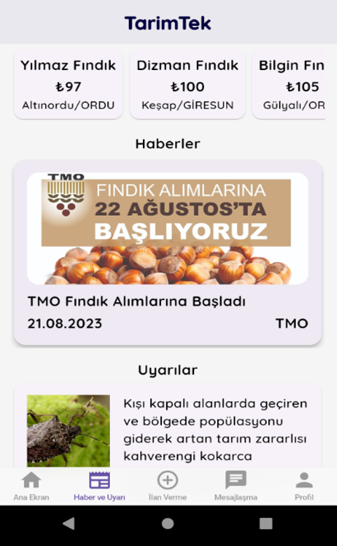
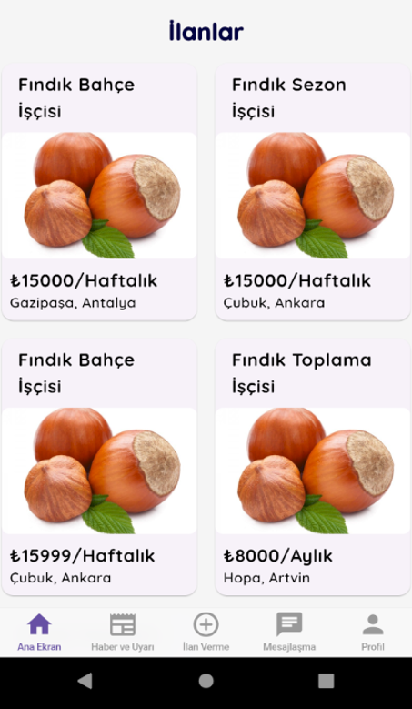
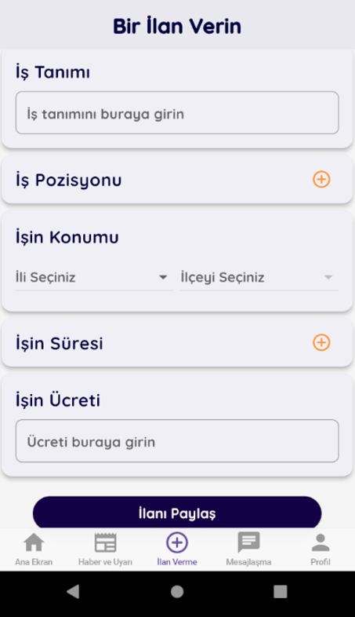
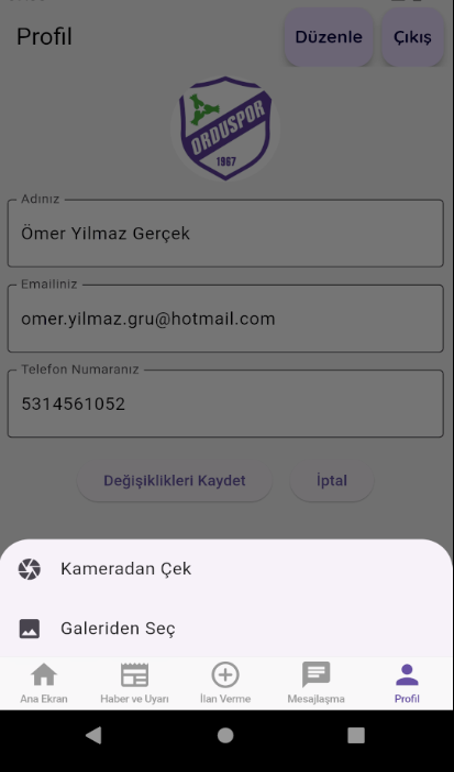

# 🌱 TarımTek

**Mobil Tarım Uygulamasıyla Tarım Sektöründe Dijital Dönüşüm, Verimlilik ve İşbirliğini Artırma Projesi**

**TÜBİTAK 2204 PROJESİ**  
**Proje Yürütücüsü:** Ömer Yılmaz

TarımTek, tarım sektöründeki dijitalleşme ihtiyacına yönelik olarak geliştirilmiş vizyoner bir mobil platformdur. Özellikle fındık gibi yoğun ve sezonluk insan gücü gerektiren tarım ürünlerinin süreçlerinde, üreticilerin, mevsimlik işçilerin ve sektördeki diğer paydaşların hayatını kolaylaştırmayı amaçlamaktadır.

## 📌 Proje Hakkında

TÜBİTAK-2204 proje yarışması kapsamında geliştirilen bu uygulama; tarımda üretkenliği ve verimliliği artırmak, doğru iş gücüne ve doğru işverenlere en hızlı yoldan ulaşmak, anlık piyasa fiyatlarını takip etmek ve sektörel haberlerden/uyarılardan anında haberdar olmak amacıyla tasarlanmıştır.

## 📱 Ekran Görüntüleri ve Arayüz

Projemiz son derece modern, "clean UI" standartlarına uygun ve kullanıcı odaklı bir arayüz tasarımına sahiptir. 

> **Not:** *(Projenizin ekran görüntülerini GitHub'da yan yana ve düzgün boyutta sergilemek için resimlerinizi proje dizininde bir klasöre (örn: `assets/screenshots/`) ekledikten sonra aşağıdaki gibi HTML veya markdown ile çağırabilirsiniz.)*

<div align="center">
  
  
  
</div>

<br>

<div align="center">
  
  
  
</div>

### 🌟 Öne Çıkan Özellikler

- **Piyasa Fiyatları ve Borsalar:** Güncel fındık fiyatlarını farklı alım merkezlerine (Yılmaz Fındık, Dizman Fındık vb.) göre anlık takip edebilme.
- **Haberler ve Uyarılar:** TMO alımları gibi kritik sektörel haberler veya "Kahverengi kokarca" gibi tarımsal zararlılara karşı bölgesel uyarılar.
- **Tarımsal İş İlanları Piyasası:** Üreticilerin lokasyon, çalışma süresi ve ücret belirterek hızlıca ilan ("Fındık Bahçe İşçisi" vb.) açabilmesi.
- **Güvenilir Mesajlaşma Altyapısı:** İş ilanı açan üreticiler ile tarım işçilerinin anlık ve güvenli bir şekilde yazışabilmesi.
- **Gelişmiş Kullanıcı ve Profil Yönetimi:** Hem e-posta hem de Google hesaplarıyla entegre çalışan güvenlik yapısı; kamera ve galeri entegrasyonuyla kişiselleştirilebilen profiller.

## 🛠 Kullanılan Teknolojiler

Projenin (`pubspec.yaml`) altyapısında güncel, güvenilir ve yüksek performans sağlayan endüstri standartlarındaki kütüphaneler tercih edilmiştir:

*   **Arayüz, Çerçeve & Dil:** Flutter, Dart
*   **Durum Yönetimi (State Management):** `provider` (Kullanıcı durumları ve akışları için esnek yönetim)
*   **Veritabanı (Backend):** `cloud_firestore` (NoSQL, Gerçek zamanlı veri senkronizasyonu)
*   **Kimlik Doğrulama:** `firebase_auth` & `google_sign_in` (Güvenli oturum açma yöntemleri, e-posta validasyonu için `email_validator`)
*   **Dosya ve Medya Depolama:** `firebase_storage` (İlan ve profil görselleri) & `image_picker` (Donanımsal Kamera/Galeri entegrasyonu)
*   **Mesajlaşma ve Bildirim Sistemi:** `firebase_messaging` & `flutter_local_notifications` (Gerçek zamanlı iletişim ve Push Notifications)
*   **Konum ve Harita Servisleri:** `google_maps_flutter` & `geocoding` (İlanların kullanıcı dostu olarak bölgesel tespit edilmesi)
*   **Tasarım, Tipografi & Yardımcı Araçlar:** `google_fonts`, Material & Cupertino İkonları, `intl` (tarih formatlama), `timeago` (kullanıcı dostu gönderi ve mesaj zaman damgaları).

## ⚙️ Proje Kurulumu (Geliştiriciler İçin)

Kaynak kodları kendi cihazınızda çalıştırmak için aşağıdaki yönergeleri takip edebilirsiniz:

1. Depoyu bilgisayarınıza klonlayın:
   ```bash
   git clone <repository_url>
   cd tarimtek
   ```

2. Paketleri ve bağımlılıkları indirin:
   ```bash
   flutter pub get
   ```

3. Uygulamayı bağlı bir emülatörde veya telefonda derleyin:
   ```bash
   flutter run
   ```

---

> **TÜBİTAK 2204** Araştırma ve Geliştirme etiketiyle, tarımda dijital bir dönüşüm sergilenerek yerli üreticiye doğrudan fayda sağlayacak şekilde özenle inşa edilmiştir.

**Proje Yürütücüsü:** Ömer Yılmaz
Destek, geri bildirim veya işbirlikleri için ulaşabilirsiniz.
